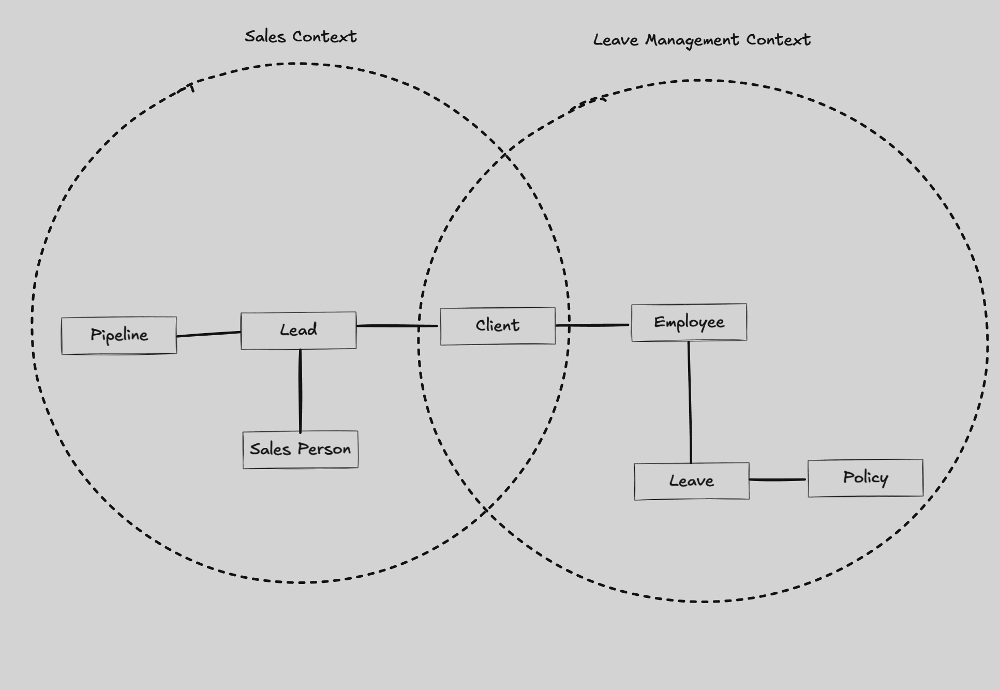
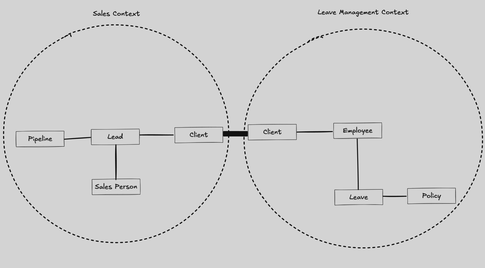
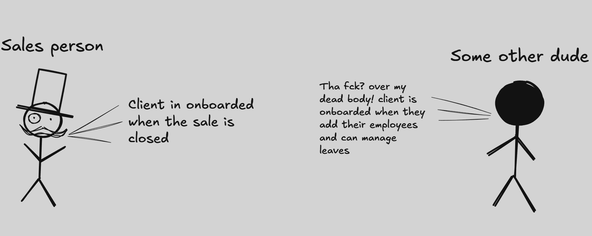

As software engineers, we're masters of overcomplicating things (hello, microservices!) and obsessively seeking rigid rules to dictate our every move. We often forget that some concepts are as straightforward as they sound. Enter **Bounded Context**—a term that might seem intimidating but is actually quite simple.

Let's break it down:

- **Context**: The circumstances or facts that surround a particular event, situation, or word and help determine its meaning.
- **Bounded**: Having limits or boundaries established.

Put them together, and **Bounded Context** is essentially a specific setting where certain terms and concepts have precise meanings within established boundaries. It's a "truth" confined within a particular area.

## So, What's the Big Deal?

In large software projects, the same word can mean different things in different parts of the system. Without clear boundaries, this can lead to confusion, miscommunication, and a codebase that takes you for a spin like no drug.

## An Everyday Example

Imagine you're working on an **HR management system** for corporate clients. One of the features you're developing is a **leave management module**. Meanwhile, your relentless sales team is out there pestering potential clients until they cave and sign a contract.

### In the Sales Context:

- **Client**: A poor soul who has endured enough sales pitches to finally agree to buy your product.

### In the Leave Management Context:

- **Client**: An organization that needs to manage vacation days, sick leaves, and other time-off requests for its employees.

Same word, **two different meanings**. Without boundaries, things get messy.

## Drawing the Lines

To prevent this chaos, we establish **Bounded Contexts**. Each context has its own model, language, and rules. In our example:

- **Sales Bounded Context**: Deals with leads, contracts, and revenue.
- **Leave Management Bounded Context**: Focuses on employees, leave policies, and approvals.

By defining these boundaries, teams can work independently without stepping on each other's toes—or code.

## Ubiquitous Language: The Double-Edged Sword

Eric Evans introduced the concept of **Ubiquitous Language** in his book _Domain-Driven Design_. The idea is to use the same vocabulary throughout the project—from conversations to code—to ensure everyone is on the same page.

Sounds perfect, right? Well, not always.

### The Problem

As the software grows, maintaining a ubiquitous language becomes as challenging as keeping a group chat on topic. Words start to lose their specific meanings. "Client" could mean ten different things to ten different people, and suddenly, your "ubiquitous" language is not so ubiquitous.

### The Solution

**Bounded Contexts** help preserve the integrity of ubiquitous language within specific domains. Each context has its own language that is ubiquitous **within that boundary**. This way, the term "client" is crystal clear in the sales context and equally clear—but differently defined—in the leave management context.

## The Happy Coincidence (Kind Of)

Here's where things get interesting. When you combine bounded contexts with event-driven architecture, you create cohesive vertical slices of functionality. These slices are:

- **Independent**: Teams can work on them without worrying about what's happening elsewhere.
- **Deployable**: You can deploy updates to one context without affecting others.
- **Maintainable**: Lower cognitive load because you're not juggling multiple meanings of the same term.

It's like having different departments in a company. Accounting doesn't need to know the nitty-gritty of marketing, and that's perfectly fine.

## Wrapping It Up

So, bounded context isn't some arcane term meant to confuse you. It's a practical concept designed to manage complexity in large software systems. By establishing clear boundaries and languages within those boundaries, you keep your codebase clean, your teams efficient, and your sanity intact.

Remember, sometimes the simplest explanations are the best—no need to overcomplicate things (we have microservices for that).
