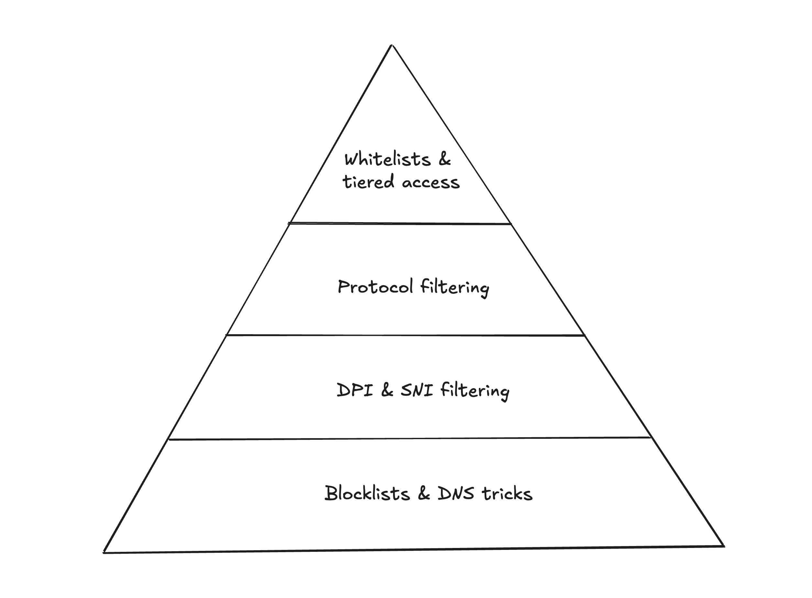
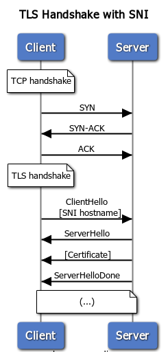
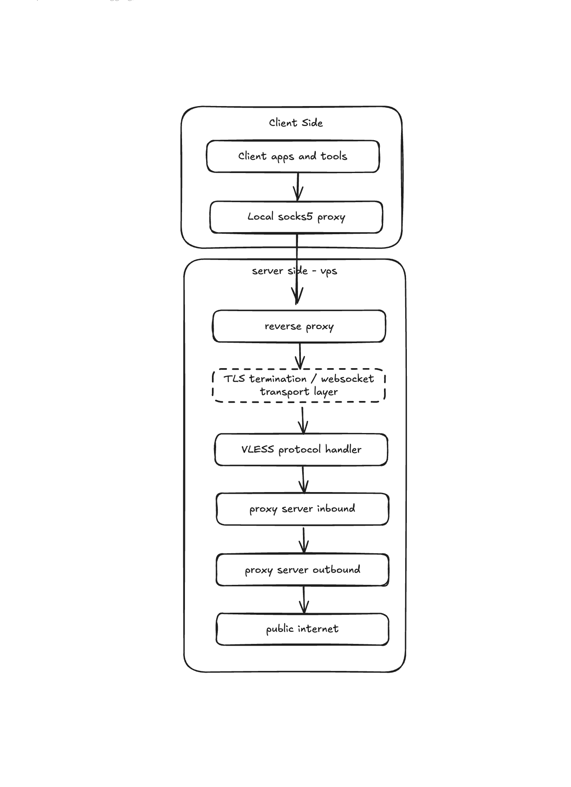
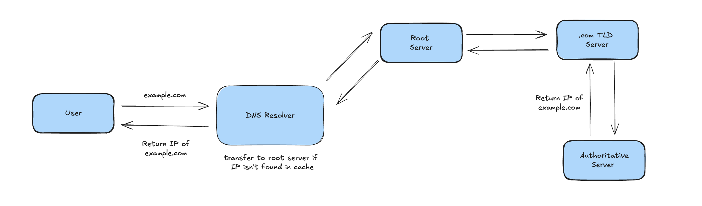

When a government blocks Telegram, YouTube, GitHub and even VPN protocols what’s left that still has to work?

Censorship rarely comes as one switch. It usually escalates through layers: first blocking specific sites, then blocking the techniques used to bypass blocks, and finally restricting the network so aggressively that only “approved” internal services remain reachable. At each step, users adapt. And during severe restrictions and near-total shutdowns in Iran, one of the most surprising adaptations has been to use the **Domain Name System (DNS)** not just for name resolution, but as a **minimal transport channel** to move small amounts of real internet traffic. It’s slow, fragile, and limited but in a crisis it can be enough to keep messages syncing and information flowing.

Before getting into more details, it’s worth zooming out for a moment and looking at how censorship has evolved.

---

# **The escalation ladder: from basic blocking to “approved-only” internet**



## **Era 1: Plain HTTP filtering, DNS tricks, and manual blocklists**

In the early web, much of the traffic was plain HTTP. That gave censorship bodies deep visibility: they could read full URLs and sometimes page contents, match keywords, and drop or redirect requests. Alongside that, DNS manipulation and static IP blacklists were common: blocked domains would resolve to fake addresses (often a block page), and known “forbidden” server IPs could be dropped at ISP gateways.

Keyword filtering in particular was blunt and error-prone. A page about breast cancer could be blocked because it contained a flagged word. A chemistry textbook, a medical forum, or a news article about a protest could all be flagged as forbidden content. This caused significant collateral damage: legitimate educational, medical, and journalistic content became inaccessible alongside the intended targets.

One side effect of keyword filtering was that it pushed writers and communities into linguistic creativity 😄. If the word "filter breaker" was flagged, people wrote "ice breaker." If "protest" was blocked, they used they used "gathering". 

People’s main workaround was simple proxies and early commercial VPNs (PPTP/L2TP/IPsec), plus early Tor. These worked largely because enforcement was still list-driven: if your proxy or VPN endpoint wasn’t on a blacklist yet, it would often function.

challenge was stability. Proxy lists got burned quickly, VPN servers were blocked as soon as they became popular, and during unrest the state could throttle bandwidth enough that images/video became unusable even when text loaded. In other words: it wasn’t only “blocked or unblocked” it was often “technically reachable but too slow to matter.”

## **Era 2: HTTPS spreads; DPI and SNI filtering reshape censorship**



As HTTPS became the default, URL keyword filtering largely broke because the path, query string, and content became encrypted. Filtering shifted to what remained visible without decryption: DNS, destination IPs, and especially the TLS handshake metadata. DPI systems could read the **SNI** field in many TLS connections (the hostname in the ClientHello) and cut connections to banned hostnames by injecting resets.

People responded with stronger circumvention: Tor bridges with obfuscation, Shadowsocks-style tools, and (for a time) techniques like domain fronting that used major CDNs as cover so the visible hostname looked allowed while the encrypted request went elsewhere.

The challenge here was that the workaround itself became the target. Once enough users relied on certain CDNs, bridges, or obfuscation patterns, blocking those created a “collateral damage” tradeoff the state was increasingly willing to accept. Meanwhile, DPI got better at recognizing traffic by statistical fingerprints and behavior, not just by destination. So tools that worked reliably one month could be unstable the next.

## **Era 3: Shutdown capability, protocol filtering, and “looks-like-HTTPS” tunnels**

This period made two things clear: State could enforce near-total blackouts during unrest while keeping domestic services (somewhat) alive, and it could also filter by “protocol shape,” not just by site. A common strategy is to allow only standard-looking traffic (often DNS/HTTP/HTTPS) and aggressively disrupt anything that behaves like a VPN or nonstandard tunnel even if it uses port 443.

People adapted by moving to tools designed specifically to blend in, including V2Ray/Xray ecosystems (VLESS/Trojan/XTLS variants) that aim to resemble normal TLS. 



A second workaround was infrastructural: **domestic relays**. Users would tunnel to a server inside Iran (more reachable, less likely to be blocked), and that server would forward to an external proxy.

The challenges were reliability and burn rate. Once a foreign endpoint is discovered, it can be blocked quickly; once a domestic relay becomes suspicious, it can be throttled, probed, or taken down. This created a cycle of short-lived configurations: users constantly needed fresh endpoints, and sharing them widely made them easier to detect. The cost shifted from “download a VPN app once” to ongoing operational maintenance.

## **Era 4: Whitelists, stealth disruption, and tiered/class-based access**

More recently, censorship has increasingly moved from blacklisting (“block known bad destinations”) toward whitelisting (“allow only known good connectivity”). This approach is often paired with stealthier disruption: instead of obvious nationwide route withdrawal, users experience aggressive throttling, intermittent TLS resets, and selective failure modes that are harder to measure from outside the country.

Another trend is **tiered access**: certain groups can receive broader connectivity through special SIMs/APNs or institutional networks, while the general population remains restricted. This is technically feasible because mobile operators can apply different routing and filtering rules based on subscriber profiles at gateway scale. Meanwhile, as the global internet deploys **ECH** (Encrypted Client Hello) to hide SNI, one blunt countermeasure is simply dropping TLS handshakes that advertise ECH support sacrificing compatibility to preserve visibility.

People’s workarounds also diversified: more probing-resistant transports (e.g., Reality-style approaches), Tor Snowflake (highly dynamic volunteer proxies), rapid endpoint rotation, and in some cases out-of-band connectivity like smuggled satellite terminals.

The challenges are harsh: whitelisting can make many endpoints unreachable regardless of protocol cleverness; dynamic systems like Snowflake can be unstable; and infrastructure workarounds become higher-risk as enforcement expands from packet filtering into identity, hosting controls, and criminal penalties.

---

# **DNSTT: When DNS is the only channel that still has to work**

Even a tightly controlled intranet needs name resolution. Banking portals, government services, domestic app stores, enterprise systems almost all of them rely on domain names somewhere in the stack. If DNS fails broadly, the operator breaks not only the global internet but also the domestic services they are trying to keep stable. That’s why, even during severe restrictions, you often still see working DNS at least to ISP resolvers, and sometimes (depending on the period and network) to a limited set of external resolvers as well.

DNSTT (DNS Tunneling Tool) takes advantage of that remaining “must-work” path. It doesn’t magically restore a normal internet connection; it repurposes DNS into a **tiny, high-latency transport** that can carry small amounts of data when other channels are unusable.

### **The core idea: turn DNS queries into packets you control**

```
.------.  |            .---------.             .------.
|tunnel|  |            | public  |             |tunnel|
|client|<---DoH/DoT--->|recursive|<--UDP DNS-->|server|
'------'  |c           |resolver |             '------'
   |      |e           '---------'                |
.------.  |n                                   .------.
|local |  |s                                   |remote|
| app  |  |o                                   | app  |
'------'  |r                                   '------'
```

Normally, DNS answers one question: “What IP address belongs to this name?” A typical query looks like “give me the A record for `example.com`.” DNSTT abuses the fact that a DNS query can include *almost any* subdomain label as long as it matches DNS character rules and length limits.

So instead of querying meaningful names, the client generates names that *contain encoded data*, for example:

`<data-chunk>.<sequence>.<random>.tunnel-example.com`

The important part is the **domain you control** at the end. If you own `tunnel-example.com` and configure it correctly, the global DNS system will eventually deliver queries for `*.tunnel-example.com` to a DNS server you operate (your **authoritative** server). That authoritative server becomes the “far end” of your tunnel.

### **The moving parts (what DNSTT actually needs)**

1. **A domain you control**
You register something like `tunnel-example.com`.
2. **Authoritative DNS under your control**
You run a DNS server (DNSTT server) that is authoritative for a subdomain (or the whole domain). Practically, you set NS records so that queries for your tunnel namespace get delegated to your server.
3. **A client inside the restricted network**
The client runs DNSTT and locally exposes something like a SOCKS proxy. Apps send traffic to that local proxy, and the client converts it into DNS-sized chunks.
4. **A recursive resolver that will forward queries**
The client sends DNS queries to whatever resolver is reachable (often the ISP resolver). That resolver is crucial: it performs recursion and will forward unknown queries onward until they reach your authoritative server. From the user’s point of view, they are “just doing DNS,” which is exactly why this sometimes survives when other outbound traffic does not.

### **Why recursion matters: you don’t need direct access to the tunnel server**




A common censorship response is “block the tunnel server’s IP.” But DNS has an architectural twist: clients typically don’t contact authoritative servers directly. They contact a recursive resolver, and the resolver contacts the authoritative server on their behalf.

So the traffic pattern often looks like:

**Client → ISP DNS resolver → (DNS infrastructure) → Authoritative DNS (DNSTT server)**

This makes enforcement harder in practice because blocking every possible path between resolvers and authoritative servers can break normal DNS resolution and international dependencies especially if the country still allows *some* external connectivity.

### **How data fits into DNS (and why it’s slow)**

DNS was not designed to carry arbitrary payloads, so DNSTT has to operate under hard constraints:

- **Name length limits:** a full domain name is limited (roughly 253 bytes total), and each label (between dots) is limited to 63 bytes. That means a single query can carry only a small payload.
- **UDP and small responses:** classic DNS uses UDP and expects small messages. Loss, reordering, and truncation are all realities you must handle.
- **Caching:** resolvers cache answers. If the tunnel reused the exact same query name, a resolver might reply from cache and never forward the query to your authoritative server. destroying the tunnel.

To cope with this, DNSTT typically:

- **encodes** binary data into DNS-safe characters (Base32 is common)
- **chunks** data across many queries
- adds **sequence numbers** so the server can reassemble the stream
- adds **randomness** so each query is unique and won’t be served from cache
- implements reliability on top (ack/retry behavior), because UDP DNS isn’t a reliable transport

The consequence is unavoidable: DNSTT has **high latency** and **very low throughput**. It’s rarely suitable for images, video, or modern web pages loaded with scripts. But for small, high-value communications like text messages, basic synchronization, short requests it can work.

One of the strangest patterns of “hard times” is that they force technical creativity. When people are pushed into a corner when normal communication channels are cut, when VPNs are fingerprinted and reset, when infrastructure is restricted they start treating the internet less like a collection of apps and more like a set of fundamental protocols. They look for whatever still works reliably enough to carry a signal.

That’s the interesting (and painful) fact I wanted to bring attention to: in shutdown scenarios, *name lookups* become one of the last remaining ways to move information. It’s a bleak kind of creativity, born out of pressure not curiosity. But it shows how far people will go to stay connected when the normal internet is taken away.

**Shoutout**

This article was inspired by an excellent technical video by [Jadi](https://github.com/jadijadi). Thanks, Jadi, for the clear breakdown of DNS tunneling and for documenting what connectivity looks like under extreme restriction. 

I've done my best to explain these concepts, but I'm sure you'll find a much clearer and more thorough explanation in Jadi's original video. He covers DNS tunneling with a depth and clarity I can't claim to match I strongly recommend watching it: [How People Smuggle the Internet Through DNS - YouTube](https://youtu.be/Bnir1IQAPPE?si=O_8u5swBmLcAnHXk).

**Learn more**

If you want to go deeper on DNSTT itself, how to set it up, how it works under the hood, and the source code the project's official page is the best starting point: [bamsoftware.com/software/dnstt](https://www.bamsoftware.com/software/dnstt/).